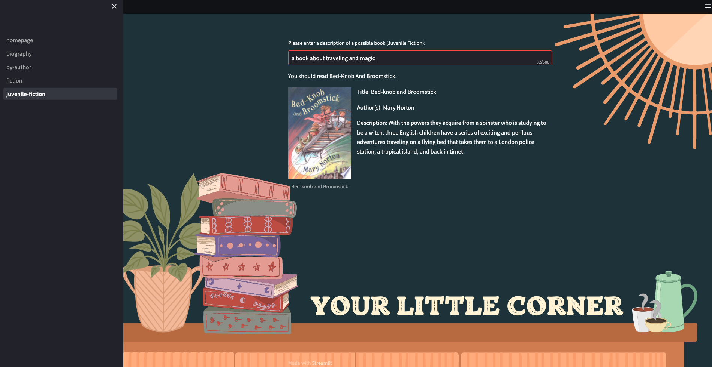

# Book Recommendation System
---
## Table of Contents
- [Background](#background)
- [Problem Statement](#problem-statement)
- [Modeling Goals](#modeling-goals)
- [Data](#data)
- [Methodology](#methodology)
    - [Data Collection](#data-collection)
    - [Data Cleaning](#data-cleaning)
    - [Exploratory Data Analysis](#eda)
    - [Preprocessing](#preprocessing)
    - [Modeling](#modeling)
- [Streamlit App](#streamlit-app)
- [Conclusions](#conclusions)

# Background
---
Why do people enjoy reading? For some, they enjoy gaining knowledge or developing new skills. Others broaden the idea as exploring a new world and an escapism of our current one. Your peers may indulge in the suspense of a murder-mystery or intensity of a fantasy adventure. They may be with a book that was printed in 1950s or sifting through the e-library of their Kindle. Although, there is no clear relationship between reading and reading purposes, Pew Research has indicated young adults read more than older adults, especially for academics ([*source*](https://www.pewresearch.org/internet/2016/09/01/book-reading-2016/)). Gallup has conducted a survey since 1990 that measures the amount of books that U.S. adults are reading on a yearly basis. Between 2016 and 2021, the average number of books read has decreased from approximately 15.6 books to 12.6. Notably, college graduates have experienced a significant decline, dropping from an average of 21.1 books to 14.6 ([*source*](https://news.gallup.com/poll/388541/americans-reading-fewer-books-past.aspx)). There is no definitive explanation of why this pattern occurs, but efforts can be made to cultivate a love for books.

# Problem Statement
---
Companies like Goodreads or Amazon will evaluate your interests, interactions, and likes to make recommendations for you. If you had consistent, positive feedback for historical-fiction, you may find your suggestions filled with such genre. In this project, I will develop a Natural Language Processing model that will most accurately classify a given book description to find the best book match. 

# Data
---
* [Book_ratings.csv](https://www.kaggle.com/datasets/mohamedbakhet/amazon-books-reviews): Dataset of 3 million book reviews scrapped from Amazon, between May 1996 - July 2014.
* [books_data.csv](https://www.kaggle.com/datasets/mohamedbakhet/amazon-books-reviews): Dataset of details for 200K+ unique books, scrapped from Google Books corresponding to the Book_ratings.csv.

Note: Data is not uploaded due to memory capacity required.

# Methodology
---
### Data Collection
* Both datasets were obtained from Kaggle. Previously, I attempted to use Google Books API, but users can only retrieve data by author or book, so it was difficult to access large amounts at a time. 

### Data Cleaning:
* Merged Book_ratings.csv and books_data.csv into one dataset through shared column, 'Title'.
* Dropped columns Id, Price, User_id, review/helpfulness, review/time, publisher, publishedDate, previewLink, and infoLink due to their redundancy or lack of information.
* Dropped null values, and was left with approximately 1.5M rows of full row data. It was not ideal to drop many rows, but the categorical values could not be replaced without rescraping the data which may lead to data leakage.
* Removed brackets in 'authors' and 'categories' since their values were listed as ['The Hobbit'] or ['Jane Austen'] to avoid issues with lemmatization.
* Created five (5) random samples of 50K rows for genres (Fiction, Juvenile Fiction, Biography & Autobiography), overall, and books with over 2000 reviews. 

### Data Dictionary
|Column|Description|
|---|---|
|Title|book title|
|profileName|profile name of person who left book review|
|reviewScore|score x/5 for book|
|review/summary|short summary of book review|
|review/text|full text of book review|
|description|book description/summary|
|authors|author(s) of book|
|image|link to book cover|
|categories|book genre|
|ratingsCount|number of ratings left for book, at time of collection|

### Exploratory Data Analysis
* Created table showing the unique authors and titles for genres (Fiction, Juvenile Fiction, Biography & Autobiography)
* Created barcharts comparing n-grams of genres (Fiction, Juvenile Fiction, Biography & Autobiography), filtered by Description and Reviews
* Generated word clouds for genres (Fiction, Juvenile Fiction, Biography & Autobiography) to find the most common words or phrases within Description
* Used pre-trained SentimentIntensityAnalyzer to view the emotional tone of reviews for genres (Fiction, Juvenile Fiction, Biography & Autobiography)
* Created barcharts for most occurring author/title in overall and highly-reviewed books dataset, 
* Constructed histograms of description and review lengths for overall dataset.

### Preprocessing
* Using WordNetLemmatizer, the description text will be lemmatized to their dictionary forms. Along with that, I included conditions to remove contractions and numbers from the processing
* Through TfidfVectorizer, the pipeline measures the frequency and importance of the term within a document. 

### Modeling
* Multinomial Naive Bayes
* Random Forest Classifier

Recommendation: These models were applied to the Biography & Autobiography dataset. One issue I consistently encountered into was the memory capacity of my computer being able to run these models. Thus, I was only able to run Random Forest Classifier for a few datasets, but not all. I recommend future users use a Cloud service or memory power to be able to effectively parse through 50K rows of data.

|Model|Recall|Precision|F1|Accuracy
|---|---|---|---|---|
|Baseline| NA|NA|NA| 0.0232|
|Multinomial Naive Bayes|0.8381|0.7403|0.7794|0.8381|
|Random Forest|0.9149|0.8752|0.8889|0.9149|

### Modeling Results (Overall)
|Dataset|Model|Recall|Precision|F1|Accuracy
|---|---|---|---|---|---|
|**Fiction**|Multinomial Naive Bayes|0.6714|0.5155|0.5702|0.6714|
|**Juvenile Fiction**|Random Forest|0.8477|0.7744|0.8016|0.8477|
|**Biography & Autobiography**|Random Forest|0.9149|0.8752|0.8889|0.9149|
|**Overall (by Author)**|Multinomial Naive Bayes|0.5622|0.44|0.4672|0.5622|
|**Overall (by Title)**|Multinomial Naive Bayes|0.4801|0.3282|0.3688|0.4801|
|**Most Reviewed**|Random Forest|0.9958|0.9918|0.9937|0.9958|

### Evaluation
Random Forest Classifier had an accuracy score of 91.49%, compared to the Multinomial Naive Bayes at 83.81%. This would mean, given a description, we would likely be correct 91.49% of the attempts we make. To further evaluate, the recall score reached 91.49% that indicated true positive predictions in relation to all possible positive cases. It was important to reduce the false negatives in this instance it was worst for a reader to not have any recommendation than to have a bad recommendation (false positive). However, an argument can be made for the Multinomial Naive Bayes models even though they performed between 40-60% as the baseline accuracy is below 5%.

### Steamlit App

I developed a mock of what this model would hypothetically do in the real-world. Through Streamlit, it would take the user to the homepage where they can select the genre they would like to receive a recommendation in. Unfortunately, I was having issues with the code and developed multiple pages to simulate my intentions with the Streamlit App. For example, if you were to go to the 'Juvenile Fiction' section in the sidebar, you could type in a description for a book you'd like to read (e.g. "I want a book about colors"). The model will return a prediction from our dataset whose description closely resembles what you had asked for.

There are improvements to be made with this application. In the future, I would want to configure the selection options into one space rather than individual buttons. A potential idea that could be explored is for users to input a book, rank it, and the model would send back a prediction based on your ranking.

Note: To accomplish this Streamlit App, I pickled all of the best models that ran for each dataset. From there, I read in the respective datasets so that the predictions can be retrieved. The data/ and pickled-models/ folders were too large to upload onto Github.

# Conclusions
---
### Future Recommendations
* Experimenting with different models, especially for multiclass, imbalance datasets: One aspect future users could explore is looking at different ways to measure the distance between vectors (e.g. cosine, Euclidean) to help find similarity in texts. The model performs well with simple descriptions, but when you get into complex instructions, it struggles incredibly and will only take on component of what you write down and base its prediction off of that. 
* Adding other components to modeling (e.g. user satisfaction, review data, memory storage): The model automatically assumes that the user wants to find the book that is closely similar to the description given. However, if we wanted more dimensionality, we would enable user input to rank or interact with their feelings of what they are searching for in a book. An example would be searching for books that are NOT about a wizard and a magical school, but the model would likely return a book similar since it overlooks 'NOT'.
* Explore hyperparameters within models (with computer capability): I suggest going further with hypertuning to see how we can best improve them before trying other models out fully. 
